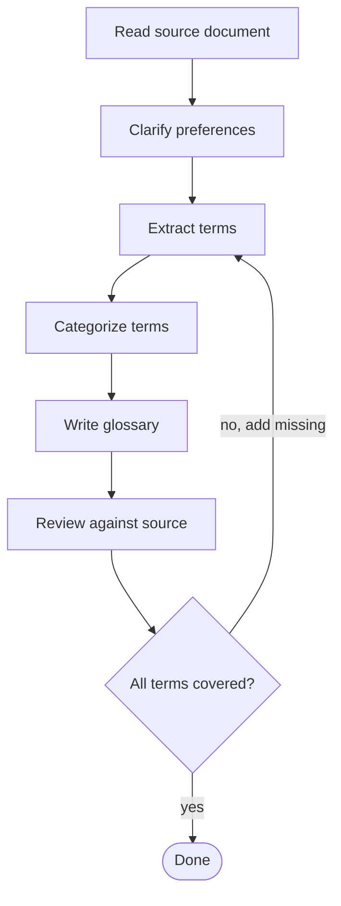

# Creating a Glossary

Create a well-structured glossary of domain terms from a source document (requirements, spec, etc.) through collaborative refinement with the user.

## When to Use

- User asks to create a glossary, term list, or domain vocabulary
- User wants to extract and define terms from a requirements or design document

## Process



### 1. Clarify Preferences

Ask the user **one question at a time** about:

| Question | Options | Why it matters |
|----------|---------|----------------|
| Language | Source doc language, user's language, bilingual | Determines readability for target audience |
| Audience | Developers, users, both | Affects definition depth and jargon level |
| Scope | Domain-only, +platform concepts, +general tech terms | Prevents bloat or gaps |
| Entry format | Definition only, +examples/snippets, +requirement refs | Drives entry structure |
| Ordering | Alphabetical, by category, category+alpha | Affects discoverability |

Prefer **multiple choice** questions. Skip questions with obvious answers from context.

### 2. Extract Terms Systematically

Walk through **every section** of the source document. For each section, identify:

- Named concepts (capitalized or explicitly defined)
- Configuration keys and values
- Distinct states or modes
- Platform/framework concepts used in domain-specific ways

**Avoid over-extraction:** Not every noun is a glossary term. Apply these filters:

- Merge closely related concepts into one entry (e.g., "Default Error Behavior" + "Per-Node Error Behavior" → "Error Behavior")
- Skip terms that are self-explanatory to the agreed audience
- Skip implementation details and architectural internals unless the user specifically requested them
- When in doubt, propose the term list to the user before writing definitions

**Completeness check:** Create a coverage matrix mapping source sections to extracted terms. Every section should contribute at least one term or be explicitly marked as "no domain terms."

### 3. Categorize

Group terms into 3-7 categories based on the domain structure, not alphabetically. Category names should reflect the domain (e.g., "Node Types", "Data Flow") not generic labels (e.g., "Concepts", "Terms").

**If you find yourself exceeding 7 categories**, merge related ones (e.g., "Error Handling" + "Execution" → "Execution"). Too many categories fragments the glossary and reduces scannability.

### 4. Write the Glossary

**File format:** Markdown with `##` category headings and `###` term entries.

```markdown
# GLOSSARY

Brief description of the glossary's purpose and audience.

## Category Name

### Term Name

Definition in 1-2 sentences.

​```yaml
# code snippet (only where it adds clarity)
​```
```

**Code snippets:** Include for terms that involve configuration, syntax, or API usage. Not every term needs one.

### 5. Review Against Source

Verify completeness by checking:

- [ ] Every source document section is covered
- [ ] Term count matches extraction phase
- [ ] Definitions are accurate (not paraphrased incorrectly)
- [ ] Code snippets are syntactically correct
- [ ] No general terms that don't belong in scope

## Common Mistakes

| Mistake | Fix |
|---------|-----|
| Skipping user preference questions | Always ask — defaults lead to rework |
| Using `**bold**` paragraphs instead of `###` headings | Headings enable TOC, linking, search |
| Missing terms from less prominent sections (error handling, validation, UI) | Use coverage matrix |
| Including every technical term (JSON, HTTP, etc.) | Stick to agreed scope |
| Over-extracting terms (every noun becomes an entry) | Merge related concepts, skip self-explanatory terms |
| Too many categories (8+) | Merge related categories to stay within 3-7 |
| No code snippets for configuration-heavy terms | Add YAML/code examples for config terms |
